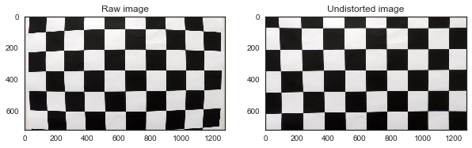
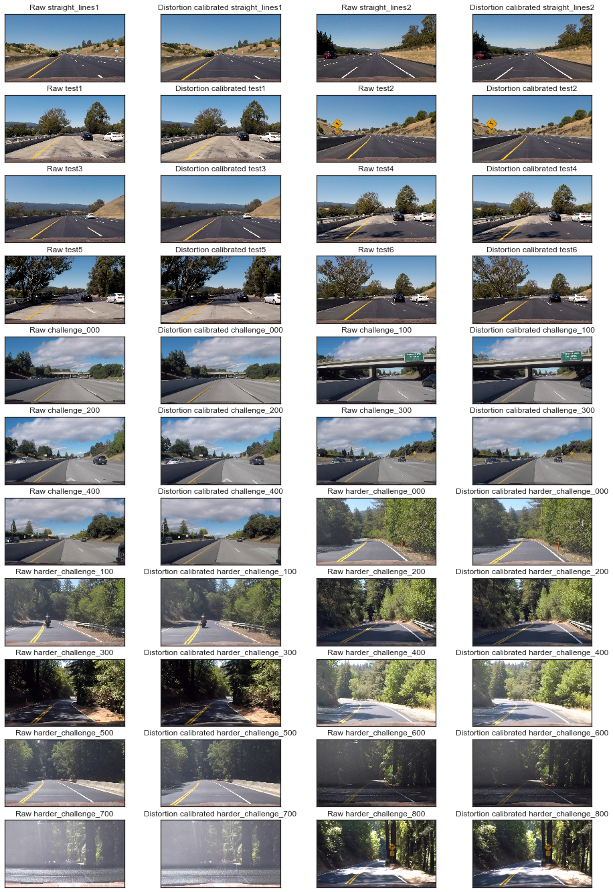
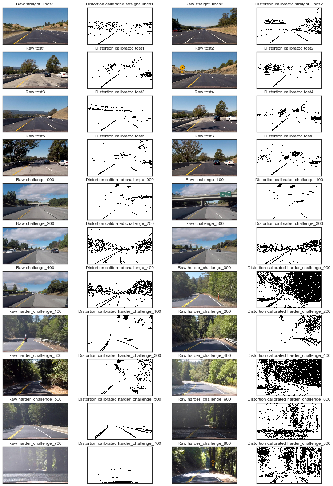
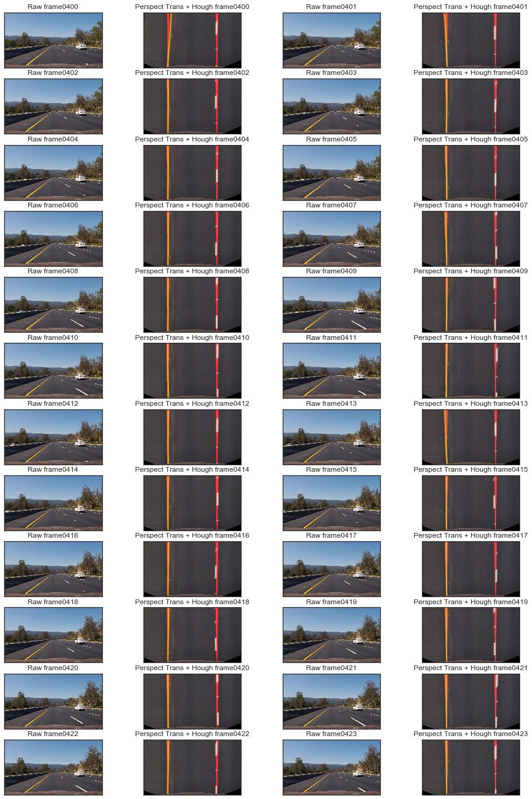
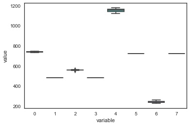
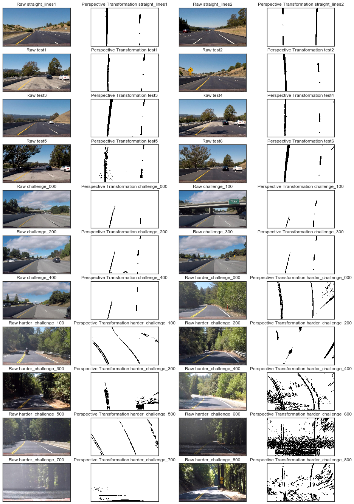
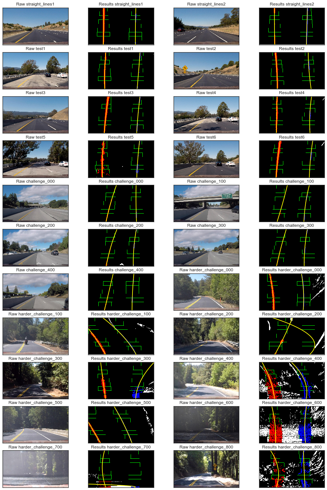
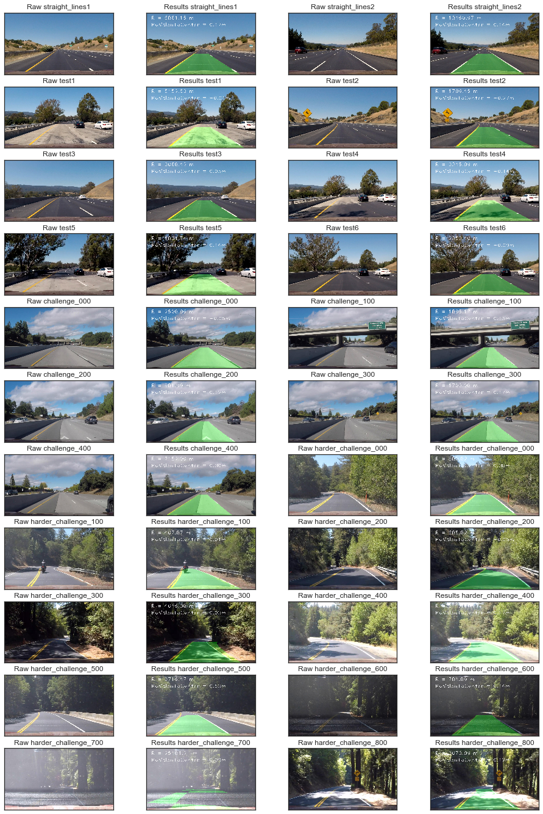

Pre inport modules:

```python
import os
import pickle
import numpy as np
import cv2
import glob
import matplotlib.pyplot as plt
import pandas as pd
import seaborn as sns

from moviepy.editor import VideoFileClip
from IPython.display import HTML

import code.HoughLines as m_Hough
import code.AdvancedLaneLines as m_AdvLine


sns.set_style("white")
%matplotlib inline
```

To get better performance, more testing images were needed. So, beside the given test images, I just split all input videos into images and using No.xx00 th image as extra testing images.


```python


#!mkdir -p project challenge harder_challenge
#clip2 = VideoFileClip('./project_video.mp4')
#clip2.write_images_sequence("project/frame%04d.jpeg")
#clip2 = VideoFileClip('./challenge_video.mp4')
#clip2.write_images_sequence("challenge/frame%04d.jpeg")
#clip2 = VideoFileClip('./harder_challenge_video.mp4')
#clip2.write_images_sequence("harder_challenge/frame%04d.jpeg")
#!mkdir -p test_extra
#!for i in 000 100 200 300 400;                do cp ./challenge/frame0$i.jpeg        test_extra/challenge_${i}.jpeg;done
#!for i in 000 100 200 300 400 500 600 700 800;do cp ./harder_challenge/frame0$i.jpeg test_extra/harder_challenge_${i}.jpeg;done
```

Next, I will consider the rubric points individually and describe how I addressed each point in my implementation.

# Rubric Points

# 1. Camera Calibration

## 1. Briefly state how you computed the camera matrix and distortion coefficients. Provide an example of a distortion corrected calibration image.

The code for this step is contained in the python file `./code/AdvancedLaneLines.py`, `def cameraCal` in line 48-67 for recalibration using given dataset, `def undistortImage` in line 70-71 for using the parameters trained in `def cameraCal` to correct distortions for the given images.

I start by preparing "object points", which will be the (x, y, z) coordinates of the chessboard corners in the world. Here I am assuming the chessboard is fixed on the (x, y) plane at z=0, such that the object points are the same for each calibration image.

As there are 6 rows and 9 columns in the chees board, `objp` is defined as a replicated array of coordinates, and `objpoints` will be appended with a copy of it every time I successfully detect all chessboard corners in a test image.  `imgpoints` will be appended with the (x, y) pixel position of each of the corners in the image plane with each successful chessboard detection.

I then used the output `objpoints` and `imgpoints` to compute the camera calibration and distortion coefficients using the `cv2.calibrateCamera()` function.  I applied this distortion correction to the test image using the `cv2.undistort()` function and obtained this result:


```python
l_images = !ls ./camera_cal/*
```


```python
advLine = m_AdvLine.AdvancedLaneLines()
advLine.cameraCal(l_images)

img = m_AdvLine.loadRGBFile("./camera_cal/calibration1.jpg")
udst = advLine.undistortImage(img)

fig = plt.figure( figsize=(10, 5) )
ax1 = fig.add_subplot(121)
ax2 = fig.add_subplot(122)
ax1.imshow(img, 'gray')
ax2.imshow(udst, 'gray')

ax1.set_title("Raw image")
ax2.set_title("Undistorted image")

```


    <matplotlib.text.Text at 0x7f90a93a0240>





# 2. Pipeline:
##  2.1 Provide an example of a distortion-corrected image.

To demonstrate this step, I will describe how I apply the distortion correction method, which were described in Section 1.1, to all test images like this one:


```python
test_images   = !ls ./test_images/*
test_images2  = !ls ./test_extra/*
test_images += test_images2

fig = plt.figure( figsize=(16, 24) )
for i,img in enumerate(test_images):
    img = m_AdvLine.loadRGBFile(img)
    udst = advLine.undistortImage(img)
    ax1 = fig.add_subplot(len(test_images)/2, 4, i*2+1)
    ax2 = fig.add_subplot(len(test_images)/2, 4, i*2+2)
    ax1.imshow(img, 'gray')
    ax2.imshow(udst, 'gray')
    ax1.set_title( "Raw %s" % (os.path.basename(test_images[i]).split(".")[0]) )
    ax2.set_title( "Distortion calibrated %s" % (os.path.basename(test_images[i]).split(".")[0]) )
    for ax in [ax1, ax2]:
        ax.set_xticks([])
        ax.set_xticklabels([])
        ax.set_yticks([])
        ax.set_yticklabels([])

```





# 2. Describe how (and identify where in your code) you used color transforms, gradients or other methods to create a thresholded binary image. Provide an example of a binary image result.

In fact, I did this step after step3(perspective transform). As perspective transformation is just like a ROI selection, many noisy signals would be removed after step3 so the color/gradient piture would be much more clear.

Although I could do this step first and then transformation, I still do the transformation step first because a two step strategy were used to binarize these pictures:

- Step1: Using HSV V channel. Top 2% and above 180 V channel would emit 1 and the rest position would emit 0.
- Step2: In the bottom 200 lines in a picture, if there were less than 50 lines with no 1, the gradient based method would be tried using the L channel of HLS with ```cv2.Sobel(hls[:,:,1], cv2.CV_64F, 1, 0)```. Results in [10, 100] would emit 1 and the rest 0.

So, here the results would be shown just for meeting the rubric point. These binary images would be shown again in step3. The code two step strategy for image binarization were put in `code/AdvancedLaneLines.py`, function `def binarizeImage` (line 83-107).


```python
fig = plt.figure(figsize=(16, 24))
for i,img in enumerate(test_images):
    img = m_AdvLine.loadRGBFile(img)
    img = advLine.undistortImage(img)
    mask_image = advLine.binarizeImage(img)

    n = 2
    ax1 = fig.add_subplot(len(test_images)/2, 4, i*2+1)
    ax2 = fig.add_subplot(len(test_images)/2, 4, i*2+2)

    ax1.imshow(img)
    ax2.imshow(mask_image, 'Greys')

    ax1.set_title( "Raw %s" % (os.path.basename(test_images[i]).split(".")[0]) )
    ax2.set_title( "Distortion calibrated %s" % (os.path.basename(test_images[i]).split(".")[0]) )
    for ax in [ax1, ax2]:
        ax.set_xticks([])
        ax.set_xticklabels([])
        ax.set_yticks([])
        ax.set_yticklabels([])


```





# 3. Describe how (and identify where in your code) you performed a perspective transform and provide an example of a transformed image.

The code for my perspective transform includes a function called `def perspectTrans()`, which appears in lines 78-81 in the file `./code/AdvancedLaneLines.py`.  The `perspectTrans()` function takes as inputs an image matrix (`img`), as well as source (`src`) and destination (`dst`) points. The `dst` Point were defined as:

num|x|y
---|---|---
1|960|0
2|320|0
3|960|720
4|320|720

However, for detecting src points in the input images, I used the functions of my [P1 code](https://github.com/huboqiang/CarND-LaneLines-P1) to define two direct line parallel with the two road lines using Hough transformation. The intersection point for these two lines and `y=480`, `y=img.shape[0]` would results into four points. These four points were defined as the `src` points.


To select the direct lines with Hough Transformation, some pictures for driving in direct lines were required. So I choose the 400th to 424th images for `./project_video.mp4` as the input:


```python
l_proj = !ls ./project/
l_input = list(map(lambda x: "./project/%s" % x, l_proj[400:424]))
```

My P1 code were put in `./code/HoughLines.py` file, which were accessable like this:


```python
hough = m_Hough.HoughLinePoints()

fig = plt.figure(figsize=(16, 24))
for idx,image in enumerate(l_input):
    img = m_AdvLine.loadRGBFile(image)
    p1 = hough.learnFromDirectRoad(image)
    ax1 = fig.add_subplot(len(l_input)/2, 4, idx*2+1)
    ax2 = fig.add_subplot(len(l_input)/2, 4, idx*2+2)

    ax1.imshow(img)
    ax2.imshow(p1)

    ax1.set_title( "Raw %s" % (os.path.basename(l_input[idx]).split(".")[0]) )
    ax2.set_title( "Perspect Trans + Hough %s" % (os.path.basename(l_input[idx]).split(".")[0]) )
    for ax in [ax1, ax2]:
        ax.set_xticks([])
        ax.set_xticklabels([])
        ax.set_yticks([])
        ax.set_yticklabels([])

```





All src values using Hough Transformation were shown in a boxplot.


```python
import pandas as pd
import seaborn as sns
sns.set_style("white")
pd22 = pd.melt(pd.DataFrame(np.reshape(np.array(hough.l_src), [len(hough.l_src), -1]))).reset_index()
sns.boxplot(data=pd22, x='variable', y='value')
```


    <matplotlib.axes._subplots.AxesSubplot at 0x7f906c4e2240>





It seemed pretty well. So, the `src` were defined as the median value for all the 24 images:


```python
src = np.median(np.reshape(np.array(hough.l_src), [len(hough.l_src), -1]), axis=0).reshape(4,2)
src
```


    array([[  740. ,   480. ],
           [  558. ,   480. ],
           [ 1156.5,   720. ],
           [  238.5,   720. ]], dtype=float32)


The `src` value were then defined to the `self` variable in `AdvancedLaneLines` module. So for the next steps, it could be easily accessed.


```python
advLine.set_srcPoint(src)
```

I verified that my perspective transform was working as expected by drawing the `src` and `dst` points onto all test image and its warped counterpart to verify that the lines appear parallel in the warped image.


```python
fig = plt.figure(figsize=(16, 24))
for idx,image in enumerate(test_images):
    img  = m_AdvLine.loadRGBFile(image)
    udst = advLine.undistortImage(img)
    pxpt = advLine.perspectTrans(udst)
    img_bin = advLine.binarizeImage(pxpt)

    n = 2
    ax1 = fig.add_subplot(len(test_images)/2, 4, idx*2+1)
    ax2 = fig.add_subplot(len(test_images)/2, 4, idx*2+2)

    ax1.imshow(img)
    ax2.imshow(img_bin, 'Greys')

    ax1.set_title( "Raw %s" % (os.path.basename(test_images[idx]).split(".")[0]) )
    ax2.set_title( "Perspective Transformation %s" % (os.path.basename(test_images[idx]).split(".")[0]) )
    for ax in [ax1, ax2]:
        ax.set_xticks([])
        ax.set_xticklabels([])
        ax.set_yticks([])
        ax.set_yticklabels([])


```





# 4. Describe how (and identify where in your code) you identified lane-line pixels and fit their positions with a polynomial?

Then I did some other stuff and fit my lane lines with a 2nd order polynomial, which were defined in `def polyHist`, line 141 to line 230. A revision were made for the offical code. I used a flexible margin-width:

- Step1, choosing the best margin width for iniitaion(`def __searchLeftSide`, line 109-137 in `./code/AdvancedLaneLines.py`). I did not used argmax to find the best initiation point because I thought it would be influenced by noise signals. However, the best start point would not located with in `x_base +-  margin`(40 pixs). So I just increased this margin value 1.5 times for each approaches, and see if it could pass `minpix` (500 pixs). If `margin` were larger than 125, this approach would stop.

- Step2, the width of the margin were decreasing from the bottom window to the top window so that it would both find a goot starting point and avoid the effect of noise on the road . See line 186-189 in `./code/AdvancedLaneLines.py`.

Results shown as below:


```python
fig = plt.figure(figsize=(16, 24))
for idx,image in enumerate(test_images):
    img  = m_AdvLine.loadRGBFile(image)
    udst = advLine.undistortImage(img)
    pxpt = advLine.perspectTrans(udst)
    img_bin = advLine.binarizeImage(pxpt)
    binary_warped = img_bin.copy()
    try:
        hist_warped,left_fitx, right_fitx, left_fit1, right_fit1, left_fit, right_fit, ploty = advLine.polyHist(binary_warped, plot=True)
    except:
        hist_warped = binary_warped

    n = 2
    ax1 = fig.add_subplot(len(test_images)/2, 4, idx*2+1)
    ax2 = fig.add_subplot(len(test_images)/2, 4, idx*2+2)

    ax1.imshow(img)
    ax2.imshow(hist_warped)
    ax2.plot(left_fitx, ploty, color='yellow')
    ax2.plot(right_fitx, ploty, color='yellow')

    ax1.set_title( "Raw %s" % (os.path.basename(test_images[idx]).split(".")[0]) )
    ax2.set_title( "Results %s" % (os.path.basename(test_images[idx]).split(".")[0]) )
    for ax in [ax1, ax2]:
        ax.set_xticks([])
        ax.set_xticklabels([])
        ax.set_yticks([])
        ax.set_yticklabels([])
        ax.set_ylim(img.shape[0], 0)
        ax.set_xlim(0, img.shape[1])

```





# 5. Describe how (and identify where in your code) you calculated the radius of curvature of the lane and the position of the vehicle with respect to center.

I did this in lines 236-240 in my code in `./code/AdvancedLaneLines.py`, function `def calcRadiusAndPosToCenter`. Results were shown in the next section.

# 6. Provide an example image of your result plotted back down onto the road such that the lane area is identified clearly.

I implemented this step in lines 242-264 in my code in `./code/AdvancedLaneLines.py` in the function `generateOut()`.
Here is an example of my result on all test images:


```python
fig = plt.figure(figsize=(16, 24))
for idx,image in enumerate(test_images):
    img  = m_AdvLine.loadRGBFile(image)
    res =  advLine.generateOut(img)

    n = 2
    ax1 = fig.add_subplot(len(test_images)/2, 4, idx*2+1)
    ax2 = fig.add_subplot(len(test_images)/2, 4, idx*2+2)

    ax1.imshow(img)
    ax2.imshow(res)

    ax1.set_title( "Raw %s" % (os.path.basename(test_images[idx]).split(".")[0]) )
    ax2.set_title( "Results %s" % (os.path.basename(test_images[idx]).split(".")[0]) )
    for ax in [ax1, ax2]:
        ax.set_xticks([])
        ax.set_xticklabels([])
        ax.set_yticks([])
        ax.set_yticklabels([])


```





# 3.Pipeline (video)

# 1. Provide a link to your final video output.  Your pipeline should perform reasonably well on the entire project video (wobbly lines are ok but no catastrophic failures that would cause the car to drive off the road!).


Video model is quite different from a single image because we have a time series information, that is, the current image has strong connection with former images. So a 10-image previous-based median value were applied to normalize the `left_fit` and `right_fit` value, which were described in line 268-301 in `AdvancedLaneLines.py`.

My model did pretty good job in both [project_video](https://github.com/huboqiang/CarND-AdvancedLaneDetection-P4/blob/master/projectResult.mp4) and [challenge_video](https://github.com/huboqiang/CarND-AdvancedLaneDetection-P4/blob/master/challengeResult.mp4). But some catastrophic failures happened at the end of [hard_challenge_video](https://github.com/huboqiang/CarND-AdvancedLaneDetection-P4/blob/master/hardchallengeResult.mp4):


# Discussion

# 1. Briefly discuss any problems / issues you faced in your implementation of this project.  Where will your pipeline likely fail?  What could you do to make it more robust?

The problems mainly appear in hard challenge selction. Including:

- 1. Influenced by reflactions inside the car(0:07).
- 2. Wrong labeling the lane when bright and dark changes so quick on the road(0:07).
- 3. Did not take **no lane** into consideration, wrongly labeled a direct road lane(0:38-0:45). (Big trouble)

Problem 1-2 may be revised by increasing the smoothing windows, but for Problem 3, I need to restrict the condition for a successful lane detection in order.
